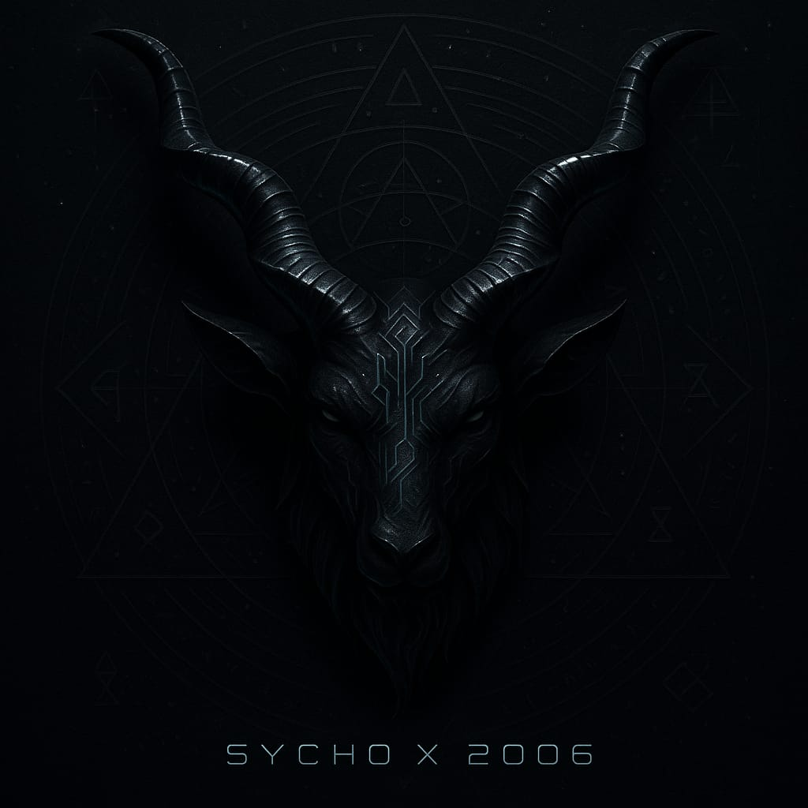
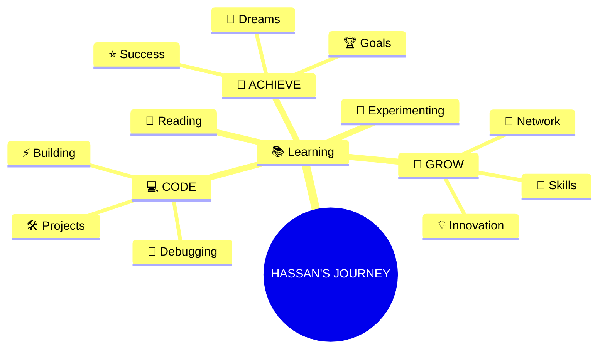

<p align="center">
  
</p>


### 🎯 About Me

```javascript
🎮 USERNAME: SychoxHassan
👤 REAL_NAME: Hassan
📍 LOCATION: Pakistan,Karachi 
🎓 CLASS: 10
⚔️  CURRENT_QUEST: "Mastering the Art of Code & Technology"
🔋 ENERGY_SOURCE: Coffee.exe + Late_Night_Grinding.dmg
🧠 MINDSET: "Learn -> Build -> Break -> Fix -> Repeat"
```

<div align="center">

### 💭 Daily Motivation

> *"The only way to do great work is to love what you do."*

                    
> *"Code is poetry written in logic."*


> *"First, solve the problem. Then, write the code."*

</div>

---

## 🕹️ Skill Tree [In Development]

<table>
<tr>
<td width="50%">

### 🎨 Creative Arsenal
```yaml
🎯 Learning:
  ├─ 💻 Programming Languages
  ├─ 🌐 Web Development
  ├─ 🧠 Problem Solving
  ├─ 📱 Mobile Apps
  └─ 🤖 Automation Scripts

🔥 Interests:
  ├─ Gaming 🎮
  ├─ Tech News 📰
  ├─ Open Source 💚
  └─ Innovation 💡
```

</td>
<td width="50%">

### 🏆 Achievements Unlocked

```diff
+ 🎓 Student Status: ACTIVE
+ 💪 Dedication Level: MAX
+ 🔥 Motivation: UNLIMITED
+ ⚡ Learning Speed: INCREASING
+ 🎯 Focus Mode: ENGAGED
+ 🚀 Dream Chaser: ACTIVATED
- 💤 Sleep Schedule: UNDEFINED
- 🐛 Bugs Fixed: COUNTING...
```

</td>
</tr>
</table>

---

## 🌌 Current Missions & Objectives

<div align="center">



</div>

### 🎯 Active Quests:

- [x] ✅ Start the learning journey
- [ ] 🔄 Master programming fundamentals
- [ ] 🔄 Build awesome projects
- [ ] 🔄 Contribute to open source
- [ ] 🔄 Launch personal portfolio
- [ ] 🔄 Create tech content
- [ ] ⏳ Change the world (work in progress)

---

## 📊 GitHub Stats:
<br/>
<br/>

---


## 🛰️ Contribution Graph

<p align="center">
  
</p>

---

## 🏆 GitHub Trophies

<p align="center">
  
</p>

---

<p align="center">
  <a href="https://sychox2006.dpdns.org">
    
  </a>
  <a href="https://github.com/sychoxhassan">
    
  </a>
  <a href="sychox2006@gmail.com">
    
  </a>
  <a href="https://www.linkedin.com/in/hassan-shehzad-3b0a24385">
    
  </a>
</p>


### 🎖️ Badges Of Honor:

[](https://github.com/sychoxhassan)
[](https://github.com/sychoxhassan)
[](https://github.com/sychoxhassan)
[](https://github.com/sychoxhassan)

</details>

<details>
<summary>🎲 Roll the Dice - Random Wisdom</summary>

### 🧠 Thought Of The Moment:

```javascript
const wisdom = [
  "Every expert was once a beginner 🌱",
  "Code today, conquer tomorrow 🚀",
  "Bugs are just features in disguise 🐛",
  "Coffee + Code = Magic ☕✨",
  "Learn, Build, Repeat 🔄",
  "The best time to start was yesterday. The next best time is now ⏰",
  "Stay hungry, stay foolish 🎯",
  "Dream big, start small, act now 💪"
];

console.log(wisdom[Math.floor(Math.random() * wisdom.length)]);
```

*Refresh the page for new wisdom!*

</details>

---

## 🎊 Contact

<div align="center">

### 💬 Let's Connect & Collaborate!

[](https://t.me/@Sychox2006)
[](https://www.linkedin.com/in/hassan-shehzad-3b0a24385)
[](mailto:sychox2006@gmail.com)
[](https://tlz.vercel.app)
[](https://discordapp.com/users/sychox2006#0000)

---

### 🤝 Open For:

- ✨ **Collaboration on projects**  
- 💡 **Learning together**  
- 🚀 **Building cool stuff**  
- 🎯 **Networking**

</div>

---

## 👁️ Visitor Counter

<p align="center">
  
</p>

</div>

---

## 🎯 Life Goals:

<table>
<tr>
<td width="33%">

### 📚 Short Term
- ✅ Stay consistent
- 🔄 Learn daily
- 🔄 Build projects
- 🔄 Network actively

</td>
<td width="33%">

### 🚀 Mid Term
- ⏳ Master skills
- ⏳ Build portfolio
- ⏳ Create impact

</td>
</td>
</tr>
</table>

---

<div align="center">

## 💖 Support & Appreciation

*If you like my journey, drop a ⭐ on my repos!*

[](https://github.com/sychoxhassan)
[](https://github.com/sychoxhassan)


</div>
